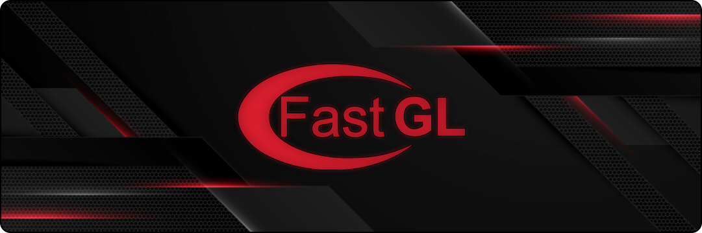

<p align="center">
  
</p>

<h1 align="center">📕 FastGL 📕</h1>

<p align="center">
  <b>✧ A very basic C++ OpenGL abstraction layer designed for learning and quick prototyping. ✧</b>
</p>

<p align="center">


</p>

---

## 🌟 Overview

**FastGL** is a **barebones C++ abstraction** for the OpenGL rendering API.  
Its main goal is to provide a simple interface for learning the concepts of OpenGL,        
without any setup required and without a lot of boilerplate code cluttering your entry point.

> Think of FastGL as a "training wheel" for learning graphics programming with OpenGL.

---

## ⚠️ Important Note

FastGL is **not** meant for production use.  
It is designed purely for **learning, experimentation, and educational projects**.

❌ We **do not recommend** using it for any serious or large-scaling projects.

---

## 🚀 Features

- 🧩 **OpenGL Object Abstractions**: Easy management for shaders, buffers, and textures.
- 📟 **Window Abstraction**: Simple abstraction of GLFW.
- 🗂️ **Shader Loading**: Load GLSL shader sources from files.
- ⚙️ **Minimal Error Handling**: Simple logging and error checks.
- 📦 **Self-Contained**: All dependencies are included, just clone and go!

---

## 🧰 Getting Started

### 1️⃣ Clone the repository
```bash
git clone https://github.com/SHARKgamestudio/FastGL
cd FastGL
```
### 2️⃣ Open in your favorite IDE
Open the solution in Visual Studio, Rider, or any IDE of choice.
(do note that the library is currently Windows only)

### 3️⃣ Run the Sandbox
Simply open the `Sandbox` project, and that's it, you are done ! Have fun learning !

### 4️⃣ Code Example :
```cpp
#include <OpenGL.h>

int main() {
    OpenGL::Window window = OpenGL::Window(800, 600, "OpenGL");

    OpenGL::CombinedShaderSrc src =
        OpenGL::getCombinedShaderSrcFromFile("your-shader.extension");

    float vertices[6] = {
        -0.5f, -0.5f,
        0.5f, -0.5f,
        0.5f,  0.5f,
    };

    unsigned int indices[3]{
		0, 1, 2,
	};

    OpenGL::VAO vao;
    OpenGL::VBO vbo(sizeof(vertices), vertices, OpenGL::DrawType::STATIC);
    OpenGL::VBL vbl;
    vbl.addElement<float>(2);
    vao.addBuffer(vbo, vbl);
    OpenGL::IBO ibo(3, indices, OpenGL::DrawType::STATIC);

    OpenGL::Shader vert(src.vert, OpenGL::ShaderType::VERTEX);
	OpenGL::Shader frag(src.frag, OpenGL::ShaderType::FRAGMENT);
    OpenGL::ShaderProgram program;
    program.attachShader(vert);
	program.attachShader(frag);

    while (!window.shouldClose()) {
		window.pollEvents();

		window.clear();

        window.draw(vao, ibo, program);

		window.swapBuffers();
    }
}
```
## 🧩 Dependencies / Credits
#### FastGL is self-contained, meaning:
- No external library installations required.
- Includes everything needed to run out-of-the-box.

#### Built using:
- C++14
- OpenGL 3.3+
- GLEW
- GLFW

This project is heavily inspired by the OpenGL series of <a src="https://www.youtube.com/@TheCherno">@TheCherno</a> on youtube.

## 🤝 Contributing
Pull requests, suggestions, and improvements are welcome!

#### If you’d like to contribute:
- 1️⃣ Fork the repo 🍴
- 2️⃣ Create a feature branch 🌿
- 3️⃣ Submit a pull request 🚀

⚠️ **YOUR ATTENTION** :
Even if there are currently no documents regarding code style or naming conventions as of right now, please make an effort to look at the library and try to match the existing codebase’s style and naming. You are smart, you can do it 🙃.

<br>
<br>
<br>
<br>

<p align="center"> <b>Made with ❤️ in France, SHARKstudio.</b><br> <sub>I'm dumb, and this project is dumb, but i hope it helps 😄</sub> </p>
